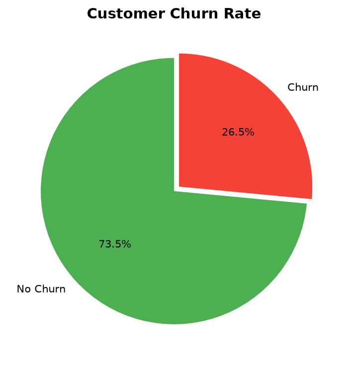
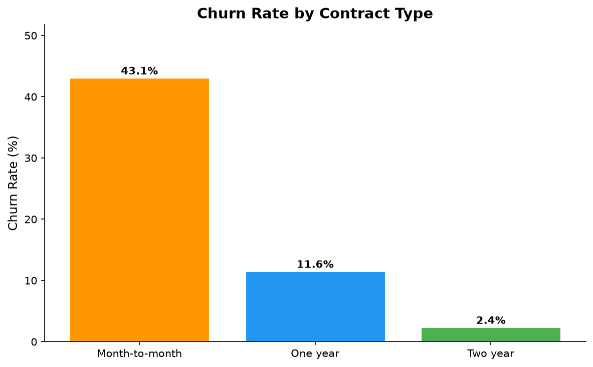
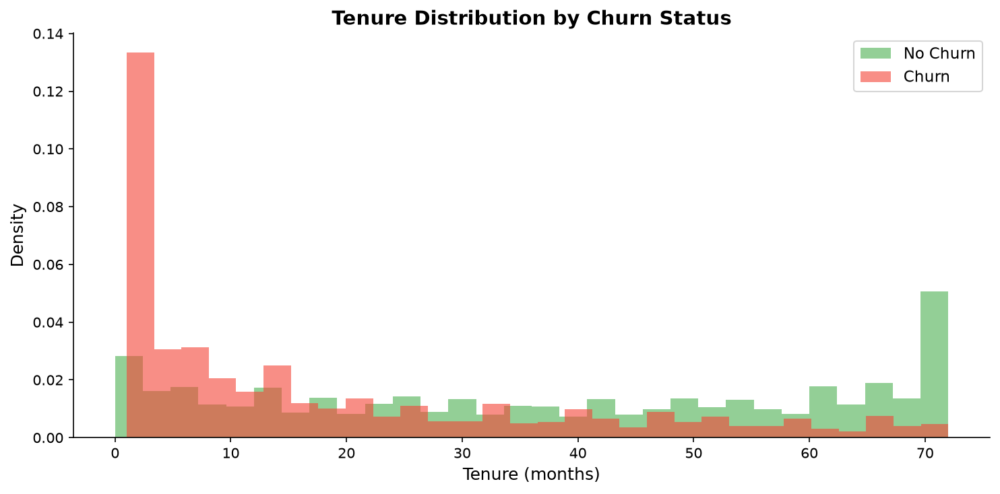
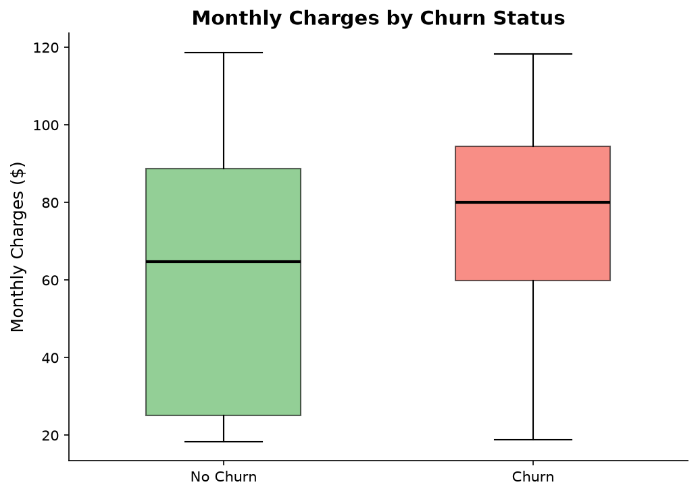
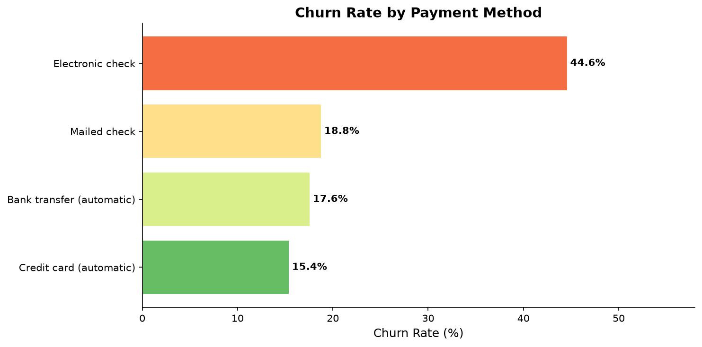
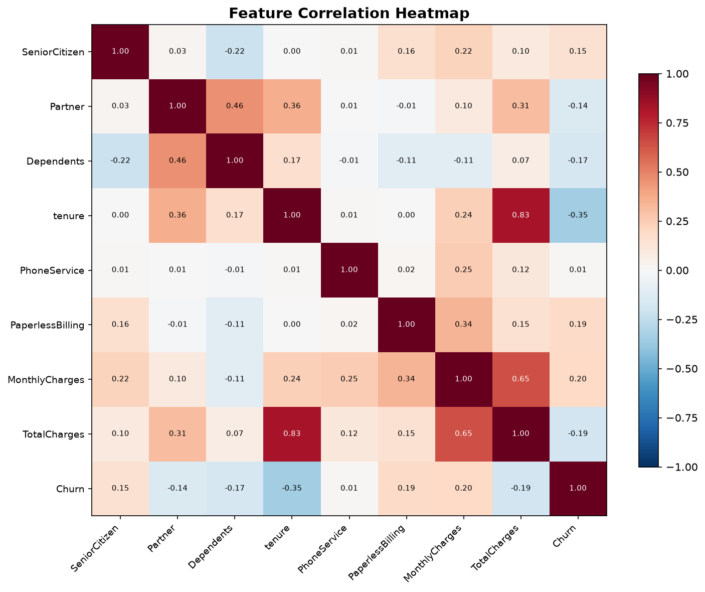
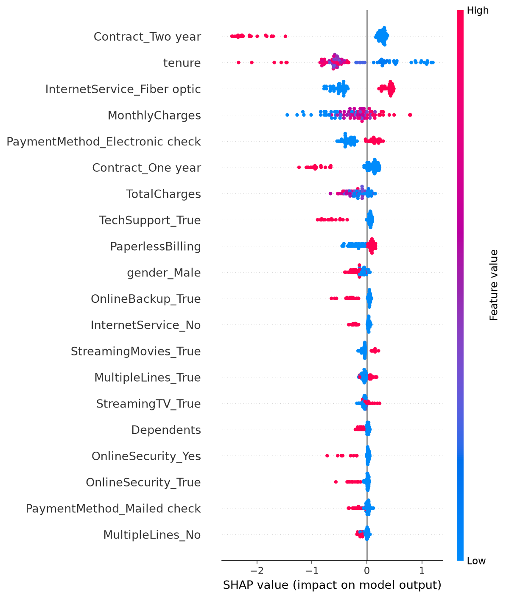

# Telco Customer Churn Prediction

[](https://python.org)
[](https://streamlit.io)
[](https://xgboost.ai)
[](LICENSE)

A **production-grade** machine learning system for predicting customer churn in telecommunications. Features an interactive Streamlit dashboard with real-time predictions, SHAP explanations, AI-powered analysis via Google Gemini, and full Docker support.

---

## Overview

| Aspect | Detail |
|--------|--------|
| **Goal** | Predict which customers are likely to churn |
| **Dataset** | 7,043 customers, 20 features (IBM Telco Dataset) |
| **Best Model** | XGBoost / LightGBM (tuned) |
| **Performance** | AUC-ROC ~0.85, F1 ~0.64 |
| **Deployment** | Streamlit + Docker |

---

## Features

### 🔮 Churn Prediction
- **Single customer**: Fill in details via sidebar sliders/dropdowns → instant prediction with gauge chart
- **Batch upload**: Upload CSV → download predictions with probability scores
- **Explainability**: SHAP bar charts show why a customer is predicted to churn

### 📈 EDA Dashboard
Interactive visualizations covering:
- Churn rate by contract type, payment method, internet service
- Tenure distribution by churn status
- Monthly charges analysis
- Feature correlation heatmap
- Senior citizen and demographic analysis

### 🤖 AI Assistant (Gemini)
Ask natural language questions like *"Why is this customer likely to churn?"* — the AI receives SHAP values and returns business-friendly explanations with retention recommendations.

---

## Model Performance

| Model | AUC-ROC | F1 | Precision | Recall |
|-------|---------|----|-----------|--------|
| Logistic Regression | 0.85 | 0.64 | 0.59 | 0.69 |
| Decision Tree | 0.75 | 0.57 | 0.52 | 0.64 |
| Random Forest | 0.83 | 0.61 | 0.57 | 0.65 |
| XGBoost | 0.81 | 0.58 | 0.54 | 0.64 |
| LightGBM | 0.83 | 0.59 | 0.55 | 0.65 |
| Voting Ensemble | 0.84 | 0.63 | 0.58 | 0.68 |

The best model is tuned via **RandomizedSearchCV with StratifiedKFold** cross-validation.

---

## Visualizations

### Churn Rate


### Churn by Contract Type


### Tenure Distribution


### Monthly Charges by Churn


### Churn by Payment Method


### Feature Correlation Heatmap


### SHAP Feature Importance


---

## Project Structure

```
├── src/
│   ├── data/
│   │   ├── load_data.py      # Data loading, cleaning, preprocessing
│   │   └── eda.py             # EDA visualization generation
│   ├── models/
│   │   ├── train.py           # Model training, tuning, SHAP
│   │   └── predict.py         # Single & batch prediction
│   └── app/
│       └── app.py             # Streamlit web application
├── data/
│   ├── telco.csv              # Raw dataset
│   ├── cleaned.csv            # Cleaned dataset
│   └── processed/             # Train/test splits (generated)
├── models/
│   ├── best_model.pkl         # Trained best model
│   └── model_comparison.csv   # Performance comparison
├── images/                    # README figures
├── Dockerfile
├── docker-compose.yml
├── requirements.txt
├── run_pipeline.py            # Run full ML pipeline
├── run_app.py                 # Launch Streamlit
└── .env.example               # Environment template
```

---

## Quick Start

### Local
```bash
git clone https://github.com/ndumbe0/telcochurn_project.git
cd telcochurn_project
python -m venv venv
source venv/bin/activate          # Windows: venv\Scripts\activate
pip install -r requirements.txt
cp .env.example .env              # Add GOOGLE_AI_API_KEY (optional)
python run_pipeline.py            # Train all models (~5 min)
streamlit run src/app/app.py      # Launch app
```

### Docker
```bash
docker-compose up --build
# Open http://localhost:8501
```

---

## Environment Variables

| Variable | Required | Description |
|----------|----------|-------------|
| `GOOGLE_AI_API_KEY` | No | Gemini API key for AI assistant features |

---

## Tech Stack

- **Frontend**: Streamlit, Plotly, Altair
- **ML**: scikit-learn, XGBoost, LightGBM, SHAP, SMOTE
- **AI**: Google Gemini (genai)
- **Deployment**: Docker, docker-compose
- **Infrastructure**: Python 3.11, pandas, numpy

---

## License & Credits

**Owner**: Moses N Ndumbe ([ndumbemoses@gmail.com](mailto:ndumbemoses@gmail.com))

Built as part of the **Azubi Africa Career Accelerator Program** (LP2 Classification Project).

**Team Lead**: Ms. Portia Bentum ([portia.bentum@azubiafrica.org](mailto:portia.bentum@azubiafrica.org))

---

> **Disclaimer**: Environment variables and database credentials are not committed. See `.env.example` for the required template.
