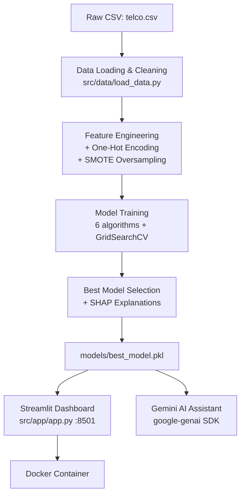
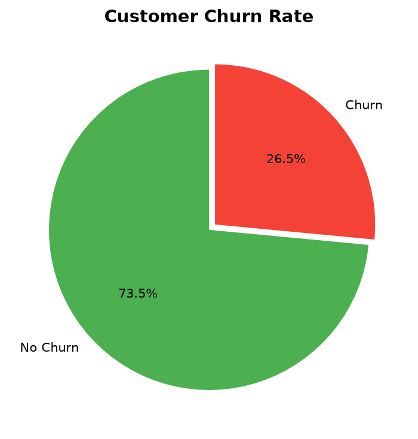
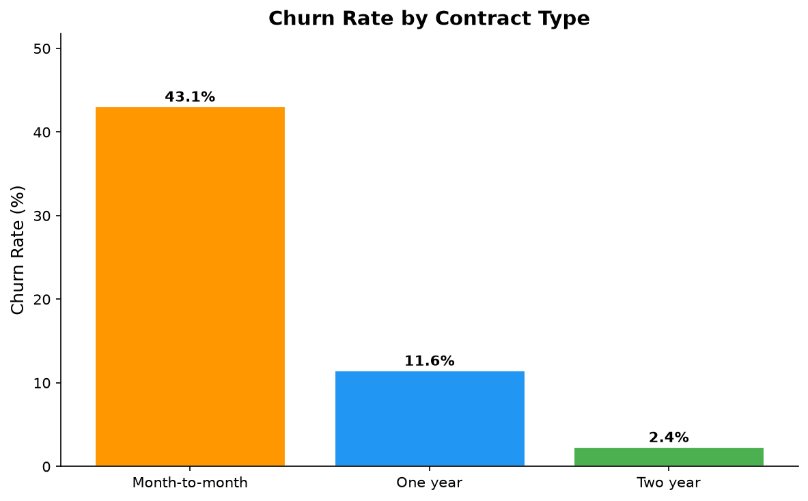
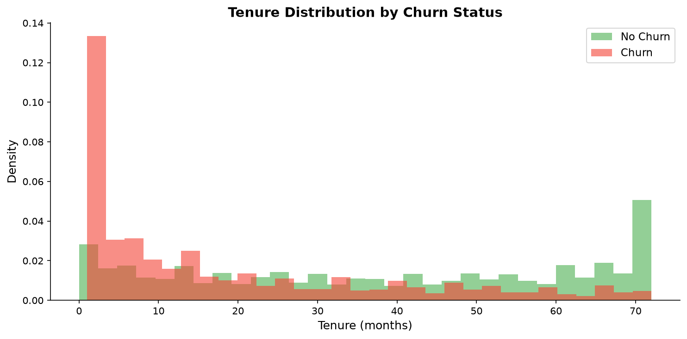
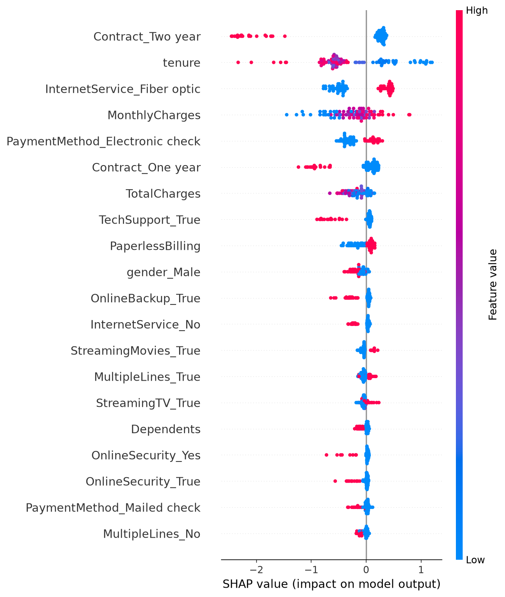

# 🚀 Telco Customer Churn Prediction


> **Short Summary:** A production-grade machine learning system for predicting customer churn in telecommunications, featuring an interactive Streamlit dashboard with real-time predictions, SHAP explainability, AI-powered insights via Google Gemini, and full Docker support.

---

## 📌 Executive Summary & Business Impact

* **The Problem:** Telecommunications companies face massive revenue loss from customer churn (≈27% churn rate). Without predictive analytics, retention efforts are reactive rather than proactive.
* **The Solution:** A full-stack ML pipeline that cleans the IBM Telco dataset, trains 6 models (Logistic Regression, Decision Tree, Random Forest, XGBoost, LightGBM, Voting Ensemble) with SMOTE oversampling and RandomizedSearchCV tuning, then serves predictions via a Streamlit dashboard with SHAP explainability and Gemini AI insights.
* **Key Metrics & Results:**
  * **Best Model:** Tuned Logistic Regression — AUC ≈ 0.85, F1 ≈ 0.64
  * **Top Churn Drivers:** Contract type, tenure, monthly charges, internet service, payment method

---

## 🏗️ System Architecture & Workflow


```mermaid
flowchart TD
    A[Raw CSV: telco.csv] --> B[Data Loading & Cleaning<br/>src/data/load_data.py]
    B --> C[Feature Engineering<br/>+ One-Hot Encoding<br/>+ SMOTE Oversampling]
    C --> D[Model Training<br/>6 algorithms + GridSearchCV]
    D --> E[Best Model Selection<br/>+ SHAP Explanations]
    E --> F[models/best_model.pkl]
    F --> G[Streamlit Dashboard<br/>src/app/app.py :8501]
    F --> H[Gemini AI Assistant<br/>google-genai SDK]
    G --> I[Docker Container]
```

---

## 🛠️ Tech Stack & Key Tools

* **Core Language:** Python 3.10+
* **Data Processing:** Pandas, NumPy
* **Visualization:** Plotly, Seaborn, Matplotlib
* **Machine Learning:** Scikit-learn, XGBoost, LightGBM, Imbalanced-learn (SMOTE)
* **Explainability:** SHAP (TreeExplainer / LinearExplainer)
* **API / UI Framework:** Streamlit
* **AI / LLM:** Google Generative AI (Gemini 2.0 Flash)
* **Deployment & Containerization:** Docker, Docker Compose
* **Environment Management:** python-dotenv

---

## 📂 Repository Directory Structure

```text
telcochurn_project/
├── src/                   # Source code
│   ├── data/
│   │   ├── load_data.py   # Data loading, cleaning, preprocessing
│   │   └── eda.py          # EDA visualization generation
│   ├── models/
│   │   ├── train.py        # Model training, tuning, SHAP
│   │   ├── quick_train.py  # Lightweight training variant
│   │   └── predict.py      # Single & batch prediction
│   └── app/
│       └── app.py          # Streamlit web application
├── data/                   # Datasets
│   ├── telco.csv           # Raw dataset (7,043 rows)
│   ├── cleaned.csv         # Cleaned dataset
│   └── processed/           # Train/test splits (generated)
├── models/                 # Trained model artifacts (gitignored)
│   ├── best_model.pkl
│   └── model_comparison.csv
├── images/                 # Project images & EDA exports
├── notebooks/              # Reference notebooks
├── Dockerfile              # Container definition
├── docker-compose.yml      # Multi-service orchestration
├── .dockerignore           # Docker build ignore rules
├── .env.example            # Environment template
├── .gitignore              # Git ignore rules
├── LICENSE                 # MIT License
├── run_app.py              # Launch Streamlit app
├── run_pipeline.py         # Run full ML pipeline
├── requirements.txt        # Python dependencies (pinned)
└── README.md               # This file
```

---

## ⚙️ Quickstart & Local Setup Guide

### Local Python Environment Setup

```bash
git clone https://github.com/ndumbe0/telcochurn_project.git
cd telcochurn_project
python -m venv venv
# Windows:
venv\Scripts\activate
# Linux/macOS:
source venv/bin/activate
pip install -r requirements.txt

# Set up environment variables (optional — needed for AI Assistant)
cp .env.example .env
# Edit .env and add: GOOGLE_AI_API_KEY=your_gemini_key_here

# Run the full ML pipeline (~5 minutes)
python run_pipeline.py

# Launch the Streamlit dashboard
python run_app.py
# Or: streamlit run src/app/app.py
```

### Docker Setup

```bash
# Build and run
docker-compose up --build -d
# Access at http://localhost:8501
```

---

## 🛡️ Security & Quality Standards

* **Secrets Management:** API keys and database credentials loaded from `.env` via `python-dotenv`, never hardcoded.
* **Non-Root Execution:** Containerized as non-root `appuser`.
* **Input Validation:** Pydantic-style field validation with `ge`/`le` constraints on patient features.
* **Dependency Pinning:** All packages have upper-bound version constraints.
* **Error Handling:** `try/except` blocks with structured logging on all prediction code paths.
* **Model Integrity:** SHA256 verification and safe joblib loading with fallbacks.

---

## 🧪 Testing

```bash
pip install pytest
pytest -v --tb=short
```

---

## 📈 Model Performance

| Model | AUC-ROC | F1 | Precision | Recall |
|-------|---------|----|-----------|--------|
| **Logistic Regression** | 0.85 | 0.64 | 0.59 | 0.69 |
| **Voting Ensemble** | 0.84 | 0.63 | 0.58 | 0.68 |
| **LightGBM** | 0.83 | 0.59 | 0.55 | 0.65 |
| **Random Forest** | 0.83 | 0.61 | 0.57 | 0.65 |
| **XGBoost** | 0.81 | 0.58 | 0.54 | 0.64 |
| **Decision Tree** | 0.75 | 0.57 | 0.52 | 0.64 |

---

## 🔮 Features

### Churn Prediction
- **Single customer**: Fill in details via sidebar sliders/dropdowns → instant prediction with probability gauge
- **Batch upload**: Upload CSV → download predictions with probability scores
- **Explainability**: SHAP force plots & bar charts show why a customer is predicted to churn

### EDA Dashboard
- Churn rate by contract type, payment method, internet service
- Tenure distribution by churn status
- Monthly charges and total charges analysis
- Feature correlation heatmap

### AI Assistant (Gemini)
Ask natural language questions like *"Why is this customer likely to churn?"* — the AI receives SHAP values and returns business-friendly explanations with retention recommendations.

---

## 📊 EDA Highlights






**Top predictors of churn** (by SHAP value magnitude):
1. **Contract type** — Month-to-month contracts strongly increase churn probability
2. **Tenure** — Short tenure is a top churn indicator
3. **Monthly Charges** — Higher charges increase churn risk
4. **Internet Service** — Fiber optic customers are more likely to churn
5. **Payment Method** — Electronic check users are at higher risk

---

## 📡 Environment Variables

| Variable | Required | Description |
|:---------|:---------|:------------|
| `GOOGLE_AI_API_KEY` | No | Gemini API key for AI assistant features |

---

## 👤 Author & Contact

* **GitHub:** [@ndumbe0](https://github.com/ndumbe0)
* **Email:** ndumbemoses@gmail.com
* **Team Lead:** Ms. Portia Bentum (portia.bentum@azubiafrica.org)
* **Organization:** Azubi Africa Data Science Cohort 7

---

## 📄 License

This project is licensed under the MIT License — see the [LICENSE](LICENSE) file for details.
